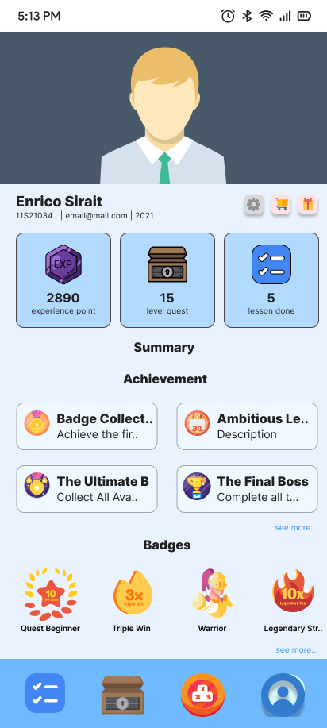

# 🧩 Progamify — Gamified Mobile Learning Application

**Progamify** is a mobile multi-platform **gamified learning application** designed to enhance digital learning engagement through gamification elements such as points, badges, leaderboards, and more.  
It consists of the following core components:

* 🎮 **Mobile Application (Flutter)**
* ⚙️ **Backend RESTful API (Golang)**
* 🖥️ **Web-based Learning Management System (Laravel Filament)**
* 🗄️ **Relational Database (MariaDB/MySQL)**

---

## 🎬 Demo Video

Experience how **Progamify** brings motivation and engagement in learning! 
[](https://youtu.be/UdVIn3OPEzw)
---

## Prototype Preview  
[](https://www.figma.com/proto/9YncClg7ZwiLVaO3ZfrwaA/Gamification?node-id=9-1466&t=tBYJjOjHZDR3aq01-1)  
*Click the image to open the interactive Figma prototype.*

👉 [Open the full interactive prototype](https://www.figma.com/design/9YncClg7ZwiLVaO3ZfrwaA/Gamification?node-id=2-2&t=tBYJjOjHZDR3aq01-1)

## 🚀 Overview

Progamify combines interactive learning and gamification principles to improve learner motivation and institutional monitoring.  
The platform follows a **Client–Server 3-Layer Architecture**, ensuring modularity and scalability between components.

| Component       | Technology         | Description                                                                                                                    |
| --------------- | ------------------ | -------------------------------------------------------------------------------------------------------------------------------|
| **Mobile App**  | Flutter (Dart)     | Provides a gamified learning experience for students with gamification elements                                                |
| **Backend API** | Golang             | Acts as middleware between the mobile app and the database, handling authentication, mobile system logic, and synchronization. |
| **Web LMS**     | Laravel + Filament | Web platform used by admins to manage courses, users, gifts and avatars directly.                                              |
| **Database**    | MariaDB/MySQL      | Centralized relational data store accessed by both the API and the Web LMS.                                                    |

---

## 🧱 System Architecture

### 🏗️ Client–Server 3-Layer Model

      +--------------------+                      +-------------------+
      | Flutter Mobile     |                      | Restful API (Go)  |
      |                    +---JSON over HTTPS---->                   +-------------------+
      | (Client Layer)     |                      | (Server Layer)    |                   |
      +--------------------+                      +-------------------+             DB Connection
                                                                                          |
      +--------------------------------+                                        +---------v---------+
      | Laravel Filament Web (Client)  |                                        |  MariaDB / MySQL  |
      |                                +---------Direct DB Connection----------->                   |
      | Direct DB Access for LMS Admin |                                        |  (Data Layer)     |
      +--------------------------------+                                        +-------------------+


### 🔍 Explanation
- The **Mobile Application** communicates with the **Golang RESTful API** using HTTP requests (JSON format).  
- The **API layer** performs logic operations, authentication, and data synchronization directly to the **Database**.  
- The **Web LMS** (Laravel + Filament) accesses the **Database directly**, used for managing content, users, and monitoring progress.  

---

## ⚙️ Tech Stack

### 🖥️ Web (LMS)
* **Framework:** Laravel 11 + Filament 3  
* **Auth:** API tokens  
* **UI:** Filament Admin Panel
* **Features:** Admin Management, Topic Management, Course Management, Lesson Management, Quest Management, Shop Management, Authentication & Authorization

---

### 📱 Mobile App
* **Framework:** Flutter 3.x  
* **API Communication:** `http`  
* **Gamification (N-EGM Framework):** Game-Based Layer, Gamification Layer, Personalization Layer, Socialization Layer  
* **Features:** Topics, Lessons, Exercises, Quests, Leaderboard, Discussion Forum, Achievements, Badges, Avatar, Gifts, Progress Tracking, Profile Management, Authentication

---

### ⚙️ Backend API
* **Language:** Go (Golang 1.22+)  
* **Framework:** Gin  
* **ORM:** GORM  
* **Middleware:** JWT Authentication  
* **Features:** RESTful Endpoints

---

### 🗄️ Database
* **Engine:** MariaDB / MySQL  
* **Schema Type:** Relational  
* **Key Tables:**  
  - `users`, `topics`, `lessons`, `exercises`, `quests`  
  - `achievements`, `badges`, `leaderboards`  
  - `shop`, `avatars`, `gifts`  
  - `topics_take`, `lessons_take`, `exercise_take`, `quest_take`, `user_achievements`, `user_badges`, `user_avatars`, `user_gifts`

---

## 🔐 Authentication Flow

| Step  | Actor           | Action                                                               |
| ----  | -------------   | -------------------------------------------                          |
| 1     | User            | Logs in through Mobile Flutter app                                   |
| 2     | API             | Validates credentials (JWT token generated)                          |
| 3     | Mobile          | Uses token for authenticated API requests                            |
| 4     | API             | Synchronizes learning progress to database                           |
| 5     | Web Admin       | Accesses dan Manage data directly through Laravel Filament dashboard |


---

## 🧰 Installation & Setup

### ⚠️ Important Notice

> ⚠️ **Repository Access Restrictions:**  
> The services for **Progamify Web (LMS)** and **Progamify RESTful API** are **private repositories** and **can only be accessed by collaborators**.  
> Only the **Progamify Mobile (Flutter)** repository is **publicly accessible** and can be cloned freely.

---

### 🔧 1. Clone the repositories

```bash
# Public Mobile App Repository (accessible to everyone)
git clone https://github.com/enrichez/Progamify_mobile.git Progamify/Progamify-Mobile

# Private LMS Repository (Laravel Filament)
# Accessible to collaborators only
git clone https://github.com/boysitorus/TA-14.git Progamify/Progamify-Web-LMS

# Private RESTful API Repository (Golang)
# Accessible to collaborators only
git clone https://github.com/boysitorus/Progamify-Restful-API.git Progamify/Progamify-Restful-API

```

### 🗄️ 2. Configure Database

Create a new database in MariaDB/MySQL:

```sql
CREATE DATABASE progamify CHARACTER SET utf8mb4 COLLATE utf8mb4_unicode_ci;
```

Update `.env` files in:

* **Laravel** → `DB_DATABASE`, `DB_USERNAME`, `DB_PASSWORD`
* **Golang API** → connection string in `config.yaml` or `.env`

---

### ⚙️ 3. Run the backend services

**Laravel (LMS)**

```bash
cd Progamify/Progamify-Web-LMS
composer install
php artisan migrate --seed
php artisan serve
```

**Golang API**

```bash
cd Progamify/Progamify-Restful-API
go mod tidy
go run main.go
```

**Flutter Mobile**

```bash
cd Progamify/Progamify-Mobile
flutter pub get
flutter run
```

---

## 🌐 API Example

**Endpoint:**

```
GET /api/v1/users/:id/achievements
```

**Response:**

```json
{
  "user_id": 12,
  "achievements": [
    { "badge": "Quiz Master", "xp": 500 },
    { "badge": "Fast Learner", "xp": 300 }
  ]
}
```

---

## 🏗️ Deployment Notes

* Web and backend services can be deployed independently using **Docker** or **Google Cloud Run**.
* Mobile application can be built for Android and iOS.
---

## 🤝 Contributors

| Role                 | Name               | Responsibility                         |
| -------------------- | ------------------ | -------------------------------------- |
| 🎮 Mobile Engineer   | **Enrico Hezkiel** | Flutter App Development & UI/UX Design |
| ⚙️ API Developer     | **Boy Sitorus**    | RESTful API (Golang)                   |
| 🖥️ Web Engineer      | **Boy Sitorus**    | Laravel Filament LMS Integration       |
| 🧪 Quality Assurance | **Emely Angelica** | Mobile and Web Testing                 |

---

## 📜 License

This project is part of the **Informatics Final Project 2024/2025 – Institut Teknologi Del**.
All rights reserved for academic use and non-commercial research purposes.

---

## 🌟 Acknowledgement

Special thanks to our lecturers, and peers who supported the development of **Progamify** — a step toward enhancing digital learning through gamification.

